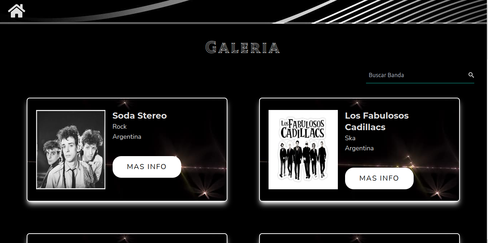

# Bandas Nacionales e Internacionales

Nuestra aplicación web, es un espacio dedicado a los amantes de la música donde podrás explorar y descubrir bandas musicales tanto nacionales como internacionales. Sumérgete en un emocionante viaje a través del fascinante mundo de la música mientras exploras una amplia colección de bandas que han dejado una marca indeleble en la historia de la música. Desde la discografía hasta los integrantes y años de formación, nuestra plataforma proporciona información detallada sobre tus bandas favoritas, ofreciéndote una experiencia completa y enriquecedora.

## Instalación

Sigue estos pasos para instalar y ejecutar la aplicación en tu máquina local

Antes de comenzar asegúrate de tener:

- [**NodeJS**](https://nodejs.org/)
- [**nvm**](https://github.com/nvm-sh/nvm)
- [**npm**](https://www.npmjs.com/)

Clona el repositorio:

```bash
git clone git@github.com:diazfabrici0/bandasMusicaAppReact.git
```

Ingresa al directorio del proyecto

```bash
cd musical-bands-app
```

Instala las dependencias:

```bash
npm install
```

Inicia la aplicación:

```bash
npm start
```

## Screenshots

- Pagina Inicial:
  
- Pagina Galeria:
  
- Pagina Detalles:
  
- Footer:
  

## Tecnologias

Para el desarrollo del proyecto se utilizó:

- 
- 
- 
- 
- 

## Autores

- [@diazfabrici0](https://github.com/diazfabrici0)
- [@josetomy07](https://github.com/josetomy07)
- [@NachoCayuqueo](https://github.com/NachoCayuqueo)
